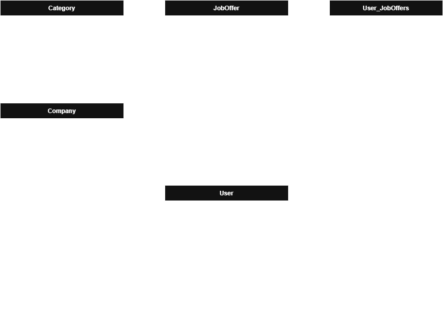

# TenMedia Survey zur Bewerbung als Praktikant von Matthias Arndt

## Aufgabe 1: Konzept

Aus der Abbildung ergeben sich die Modelle und deren Relationen, sowie folgende notwendige Seiten:
- Startseite

- Jobs
   1. Jobliste
   2. Jobdetails
   3. Job erstellen/bearbeiten

- Unternehmen
   1. Unternehmensliste
   2. Unternehmensdetails
   3. Unternehmen erstellen/bearbeiten

- Kategorien
   1. Kategorienliste
   2. Kategorie erstellen/bearbeiten

- Benutzer
   1. Benutzerliste
   2. Benutzerprofil
   3. Benutzerprofil bearbeiten
   4. Benutzer bearbeiten

- Anmeldung/Registrierung

Da aus der Aufgabenstellung nicht hervorgeht, ob die Benutzer Jobs anlegen oder folgen können/sollen, stelle ich mir zwei sinnvolle Szenarios vor, die einander nicht ausschließen: 
Szenario 1: Benutzer können Jobs/Companies/Categories anlegen, dies wird weitere 1-n-Relationen "Ersteller -> Jobs/Companies/Categories" erfordern;
Szenario 2: Benutzer können Jobs folgen/abonnieren, dies wird eine n-m-Relation "Benutzer -> Jobs" über eine Pivot-Tabelle erfordern;

## 2. Installation

Eine saubere Laravel-Installation war bei [Commit 23b6684](https://github.com/Vynvan/tenmediaSurvey/commit/23b6684101cb4221de63b06f6c7634ac630a8c00) erreicht.

## 3. Modelle, Controller, Migrations anlegen

Bei [Commit d9d7195](https://github.com/Vynvan/tenmediaSurvey/commit/d9d7195912dae3b19f38a7ce6ef332aa83d752d2) hatte ich die Modelle, Controller und Migrations erstellt und begann mit dem Implementieren von Funktionatlität.

## 3. und 4. verschwimmen

Bei [Commit 7d17283](https://github.com/Vynvan/tenmediaSurvey/commit/7d1728323883735ec11e5bd2d17487e777c178e4) habe ich mit dem Implementieren von Frontend-Pages begonnen, habe aber beim Verknüpfen mit dem Backend soviel an den Controllern und Models angepasst, dass es schwierig ist zu bestimmen, wo Aufgabe 3 endet und Aufgabe 4 beginnt.

## Fazit:

Dafür, dass dass ich vor 2 Tagen noch nicht wusste, was Laravel ist, bin ich ganz zufrieden mit meiner Leistung, auch wenn ich gerne Aufgabe 4 noch fortgesetzt hätte, aber es ist spät und ich hatte mir nur 2 Tage Zeit gegeben, davon einen Tag Vorbereiten (Composer/Laravel installieren, Doku lesen) + einen Tag Programmieren.

Viel Spaß beim Bewerten!
