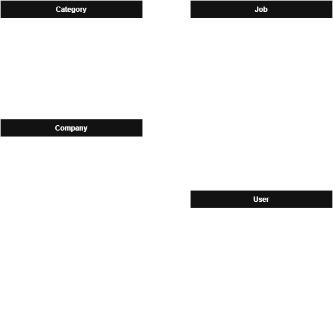

# TenMedia Survey zur Bewerbung als Praktikant von Matthias Arndt

## Aufgabe 1: Konzept

Aus der Abbildung ergeben sich die Modelle und deren Relationen, sowie folgende notwendige Seiten:
- Startseite

- Jobs
   1. Jobliste
   2. Jobdetails
   3. Job erstellen/bearbeiten

- Unternehmen
   1. Unternehmensliste
   2. Unternehmensdetails
   3. Unternehmen erstellen/bearbeiten

- Kategorien
   1. Kategorienliste
   2. Kategorie erstellen/bearbeiten

- Benutzer
   1. Benutzerliste
   2. Benutzerprofil
   3. Benutzerprofil bearbeiten
   4. Benutzer bearbeiten

- Anmeldung/Registrierung

Da aus der Aufgabenstellung nicht hervorgeht, ob die Benutzer Jobs anlegen oder folgen können/sollen, stelle ich mir zwei sinnvolle Szenarios vor, die einander nicht ausschließen: 
Szenario 1: Benutzer können Jobs und evtl. auch Companies anlegen, dies wird weitere 1-n-Relationen "Ersteller -> Jobs/Companies" erfordern;
Szenario 2: Benutzer können Jobs folgen/abonnieren, dies wird eine HasMany-Relation "Benutzer -> Jobs" über eine Pivot-Tabelle erfordern;